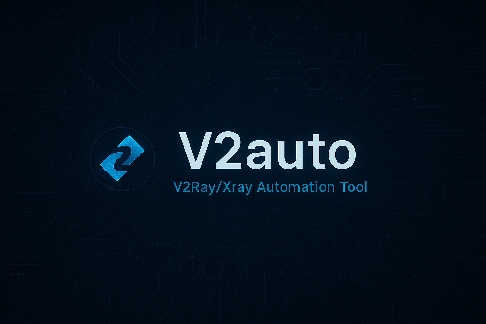

---

<div align="center">



**Auto v2ray config tester & proxy manager**  
Fetch · Test · Connect — fully automated

</div>

---

## ⚡ Quick Install

### Termux (Android)
```bash
curl -fsSL https://raw.githubusercontent.com/akarezi/V2auto/main/install.sh | bash

Ubuntu / Debian (server)

curl -fsSL https://raw.githubusercontent.com/akarezi/V2auto/main/install.sh | sudo bash

> Alternatively — download and inspect before running:

curl -fsSL https://raw.githubusercontent.com/akarezi/V2auto/main/install.sh -o install.sh
bash install.sh


---

🚀 Usage

After installation, just type:

v

Then open your browser at:

http://localhost:8080


---

📦 What the installer does

Step	Action

System packages	Installs python, pip, curl, unzip (if missing)
Python packages	Installs flask, aiohttp, requests, rich, questionary
Project files	Downloads v2auto.py and v2web.py (always replaces)
xray binary	Downloads latest release for your platform & arch
Geo files	Downloads geoip.dat and geosite.dat (skips if present)
v command	Creates alias and /usr/local/bin/v script
Termux autostart	(optional) Launches on every Termux open
systemd service	(optional, Linux only) Runs on boot, auto-restarts


---

📁 Install directory

Platform	Path

Termux	~/v2auto/
Linux	~/v2auto/ (as the invoking user)


Files created inside:

v2auto/
├── v2auto.py
├── v2web.py
├── xray
├── geoip.dat
├── geosite.dat
├── vless_working.txt
└── v2auto_uuid.txt


---

🔧 Ports

Service	Port

Web dashboard	8080
SOCKS5 proxy	10901
HTTP proxy	10801
DNS	10053
VLESS inbound	10902


---

🔄 Update

To update project files and dependencies, run:

curl -fsSL https://raw.githubusercontent.com/akarezi/V2auto/main/install.sh | bash

v2auto.py and v2web.py are always re-downloaded.
xray and geo files are only updated if confirmed.


---

🛑 systemd service (Linux)

systemctl status  v2auto
systemctl stop    v2auto
systemctl restart v2auto
journalctl -u     v2auto -f

---
